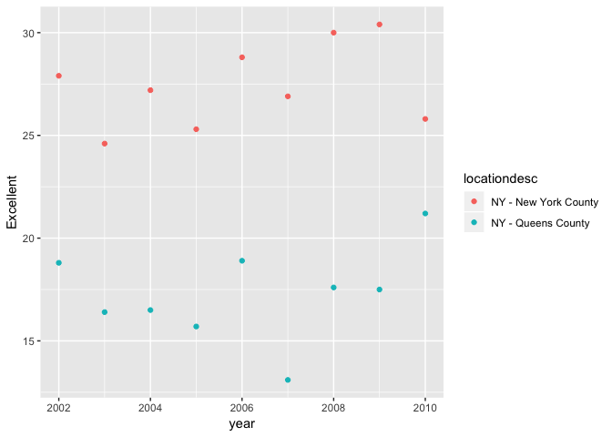

p8105\_hw2\_zdz2101
================
Zelos Zhu
9/25/2018

### Load Packages

``` r
library(tidyverse)
library(readxl)
library(p8105.datasets)
```

Problem 1
=========

``` r
nyc_transit_df <- 
  read_csv("Data Files/NYC_Transit_Subway_Entrance_And_Exit_Data.csv") %>%
  janitor::clean_names() %>%
  select(., line, station_name, station_latitude, station_longitude, route1, route2, route3, route4, route5, route6,
                route7, route8, route9, route10, route11, entrance_type, entry, vending, ada) %>% 
  mutate(entry = recode(entry, "YES" = TRUE, "NO" = FALSE))

#Distinct Stations
distinct_stations <- unique(apply(nyc_transit_df[,names(nyc_transit_df)[c(1,2,5:15)]], 1, paste , collapse = "/" ))

#ADA compliant
table(nyc_transit_df$ada)
```

    ## 
    ## FALSE  TRUE 
    ##  1400   468

``` r
#Vending and entrances
table(nyc_transit_df$entry, nyc_transit_df$vending)
```

    ##        
    ##           NO  YES
    ##   FALSE  114    1
    ##   TRUE    69 1684

##### Write a short paragraph about this dataset – explain briefly what variables the dataset contains, describe your data cleaning steps so far, and give the dimension (rows x columns) of the resulting dataset. Are these data tidy?

The dataset contains information about subway stops: name of the stop, where the stop is, what lines runs through it, the type of entrance at the specific stop, whether or not it's wheelchair friendly and whether or not vendors exist at that station.

In terms of cleaning we've done, we selected the columns that was requested of us: line, station, name, station latitude / longitude, routes served, entry, vending, entrance type, and ADA compliance. Then we changed the entry variable to be TRUE/FALSE vs YES/NO. After all this we have a result of 1868 observations and 19 variables.

##### Answer the following questions using these data:

-   How many distinct stations are there? Note that stations are identified both by name and by line (e.g. 125th St A/B/C/D; 125st 1; 125st 4/5); the distinct function may be useful here.
-   How many stations are ADA compliant?
-   What proportion of station entrances / exits without vending allow entrance?

##### Solution

-   There are 467 distinct stations.
-   There are 468 ada compliant stations.
-   Among stations without vending, there are 0.6052632 stations that allowing entrance.

\#\#\#\#\#)Reformat data so that route number and route name are distinct variables. How many distinct stations serve the A train? Of the stations that serve the A train, how many are ADA compliant?

``` r
#Reformat to combine route name and route numbers
nyc_transit_df_reformated <- nyc_transit_df %>%
  unite(route_num_name, line, route1, route2, route3, route4, route5, route6, route7, route8, route9, route10, route11, sep = "_") %>% 
  mutate(route_num_name = gsub("_NA", "", route_num_name))

head(nyc_transit_df_reformated)
```

    ## # A tibble: 6 x 8
    ##   route_num_name station_name station_latitude station_longitu…
    ##   <chr>          <chr>                   <dbl>            <dbl>
    ## 1 4 Avenue_R     25th St                  40.7            -74.0
    ## 2 4 Avenue_R     25th St                  40.7            -74.0
    ## 3 4 Avenue_N_R   36th St                  40.7            -74.0
    ## 4 4 Avenue_N_R   36th St                  40.7            -74.0
    ## 5 4 Avenue_N_R   36th St                  40.7            -74.0
    ## 6 4 Avenue_R     45th St                  40.6            -74.0
    ## # ... with 4 more variables: entrance_type <chr>, entry <lgl>,
    ## #   vending <chr>, ada <lgl>

``` r
#Filter by A stations
A_stations <- nyc_transit_df_reformated %>%
  filter(grepl("_A", route_num_name))

distinct_A_stations <- unique(A_stations$station_name)

A_stations_ada_comp <- A_stations$station_name[which(A_stations$ada == TRUE)]
```

-   There are 56 that serve the A train.
-   Among the 273 A stations, 107 are ADA compliant.

Problem 2
=========

This problem uses the Mr. Trash Wheel dataset, available as an Excel file on the course website.

Read and clean the Mr. Trash Wheel sheet: -specify the sheet in the Excel file and to omit columns containing notes (using the range argument and cell\_cols() function) -use reasonable variable names -omit rows that do not include dumpster-specific data -rounds the number of sports balls to the nearest integer and converts the result to an integer variable (using as.integer).

Read and clean precipitation data for 2016 and 2017. For each, omit rows without precipitation data and add a variable year. Next, combine datasets and convert month to a character variable (the variable month.name is built into R and should be useful).

``` r
mr_trash_wheel <- read_excel("Data Files/HealthyHarborWaterWheelTotals2017-9-26.xlsx", sheet = "Mr. Trash Wheel", range = cell_cols("A:N")) %>%
  janitor::clean_names() %>%
  filter(!grepl("Total", month)) %>%
  mutate(sports_balls = as.integer(round(sports_balls)))

precip_2016_df <- read_excel("Data Files/HealthyHarborWaterWheelTotals2017-9-26.xlsx", sheet = "2016 Precipitation", range = "A2:B14") %>%
  janitor::clean_names() %>%
  mutate(year = rep(2016, nrow(.)))

precip_2017_df <- read_excel("Data Files/HealthyHarborWaterWheelTotals2017-9-26.xlsx", sheet = "2017 Precipitation", range = "A2:B10") %>%
  janitor::clean_names() %>%
  mutate(year = rep(2017, nrow(.)))

precip_df <- rbind(precip_2016_df, precip_2017_df) %>% 
  mutate(month = month.name[month])
```

##### Write a paragraph about these data; you are encouraged to use inline R. Be sure to note the number of observations in both resulting datasets, and give examples of key variables. For available data, what was the total precipitation in 2017? What was the median number of sports balls in a dumpster in 2016?

The Mr. Trash Wheel dataset contains 318 observations with 14 variables. The precipitation data contains 20 observations with \`r ncol(precip\_df)

Problem 3
=========

This problem uses the BRFSS data. DO NOT include this dataset in your local data directory; instead, load the data from the p8105.datasets package.

For this question: -format the data to use appropriate variable names; -focus on the “Overall Health” topic -exclude variables for class, topic, question, sample size, and everything from lower confidence limit to GeoLocation -structure data so that responses (excellent to poor) are variables taking the value of Data\_value (need to go OH) -create a new variable showing the proportion of responses that were “Excellent” or “Very Good”

Using this dataset, do or answer the following:

-How many unique locations are included in the dataset? Is every state represented? What state is observed the most? -In 2002, what is the median of the “Excellent” response value? -Make a histogram of “Excellent” response values in the year 2002. -Make a scatterplot showing the proportion of “Excellent” response values in New York County and Queens County (both in NY State) in each year from 2002 to 2010.

``` r
data("brfss_smart2010")
#just a promise for now, need to run something to get it into environment
head(brfss_smart2010)
```

    ## # A tibble: 6 x 23
    ##    Year Locationabbr Locationdesc Class Topic Question Response Sample_Size
    ##   <int> <chr>        <chr>        <chr> <chr> <chr>    <chr>          <int>
    ## 1  2010 AL           AL - Jeffer… Heal… Over… How is … Excelle…          94
    ## 2  2010 AL           AL - Jeffer… Heal… Over… How is … Very go…         148
    ## 3  2010 AL           AL - Jeffer… Heal… Over… How is … Good             208
    ## 4  2010 AL           AL - Jeffer… Heal… Over… How is … Fair             107
    ## 5  2010 AL           AL - Jeffer… Heal… Over… How is … Poor              45
    ## 6  2010 AL           AL - Jeffer… Heal… Fair… Health … Good or…         450
    ## # ... with 15 more variables: Data_value <dbl>,
    ## #   Confidence_limit_Low <dbl>, Confidence_limit_High <dbl>,
    ## #   Display_order <int>, Data_value_unit <chr>, Data_value_type <chr>,
    ## #   Data_Value_Footnote_Symbol <chr>, Data_Value_Footnote <chr>,
    ## #   DataSource <chr>, ClassId <chr>, TopicId <chr>, LocationID <chr>,
    ## #   QuestionID <chr>, RESPID <chr>, GeoLocation <chr>

``` r
#find which are undesirable
names(brfss_smart2010)[-c(4:6, 8, 10:ncol(brfss_smart2010))]
```

    ## [1] "Year"         "Locationabbr" "Locationdesc" "Response"    
    ## [5] "Data_value"

``` r
brfss_smart2010 <- janitor::clean_names(brfss_smart2010) %>%
  filter(topic == "Overall Health") %>%
  select(names(.)[-c(4:6, 8, 10:ncol(.))])

brfss_smart2010_spread <- spread(brfss_smart2010, response, data_value)

prop_excellent_vgood <- length(which(brfss_smart2010$response %in% c("Excellent", "Very Good")))/ nrow(brfss_smart2010)
```

``` r
###How many unique locations are included in the dataset? Is every state represented? What state is observed the most?
length(unique(brfss_smart2010$locationdesc))
```

    ## [1] 404

``` r
length(unique(brfss_smart2010$locationabbr)) #more because we counting DC
```

    ## [1] 51

``` r
sort(table(brfss_smart2010$locationabbr), decreasing = TRUE) #New Jersey
```

    ## 
    ##  NJ  FL  NC  WA  MD  MA  TX  NY  SC  CO  OH  PA  NE  CA  UT  NH  VT  CT 
    ## 730 610 575 485 450 395 355 325 315 295 295 295 265 260 250 240 240 235 
    ##  LA  NM  OK  KS  RI  MI  MN  OR  AZ  ID  HI  ME  DE  GA  TN  IL  MO  MS 
    ## 225 215 200 190 190 170 165 165 160 160 155 155 135 135 130 125 125 115 
    ##  WY  AR  IN  AL  MT  ND  NV  SD  IA  AK  DC  KY  WI  WV  VA 
    ## 110 105 105  90  90  90  90  90  70  55  45  45  45  45  20

``` r
#In 2002, what is the median of the “Excellent” response value?
median(brfss_smart2010_spread$Excellent[which(brfss_smart2010_spread$year == 2002)], na.rm = TRUE)
```

    ## [1] 23.6

``` r
#Make a histogram of “Excellent” response values in the year 2002.
excellent_histo <- brfss_smart2010_spread %>% 
  filter(year == 2002) %>% 
  ggplot(aes(x=Excellent)) 

excellent_histo + geom_histogram()
```

    ## `stat_bin()` using `bins = 30`. Pick better value with `binwidth`.

    ## Warning: Removed 2 rows containing non-finite values (stat_bin).


``` r
ggplot(brfss_smart2010_spread[which(brfss_smart2010_spread$year == 2002),], aes(x=Excellent)) + geom_histogram()
```

    ## `stat_bin()` using `bins = 30`. Pick better value with `binwidth`.

    ## Warning: Removed 2 rows containing non-finite values (stat_bin).



``` r
#Make a scatterplot showing the proportion of “Excellent” response values in New York County and Queens County (both in NY State) in each year from 2002 to 2010.
plot_df <- filter(brfss_smart2010_spread, locationdesc %in% c("NY - New York County","NY - Queens County"))
excellent_scatter <- (ggplot(plot_df, aes(x=year, y=Excellent))
                      + geom_point(aes(color=locationdesc)))
excellent_scatter
```


